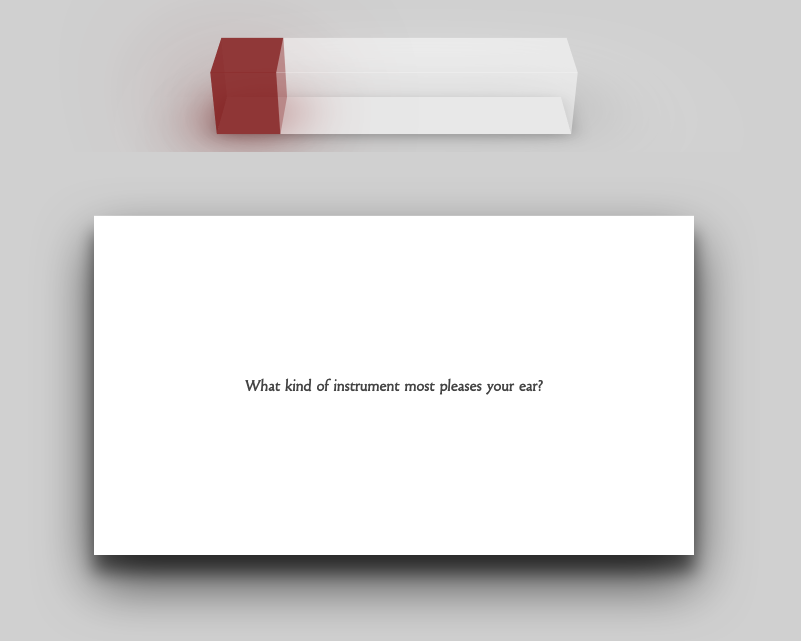
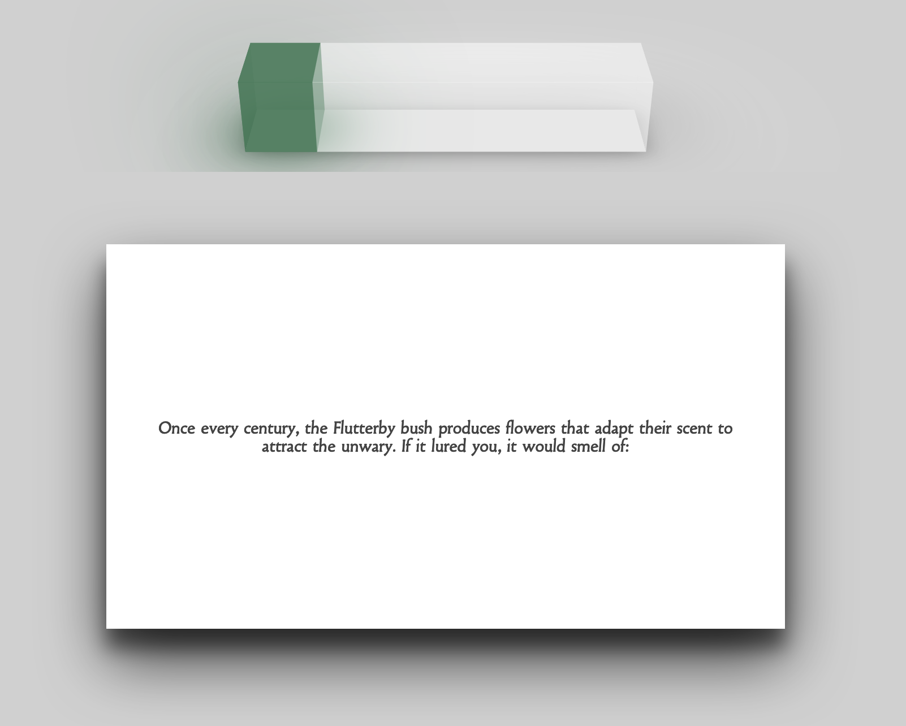
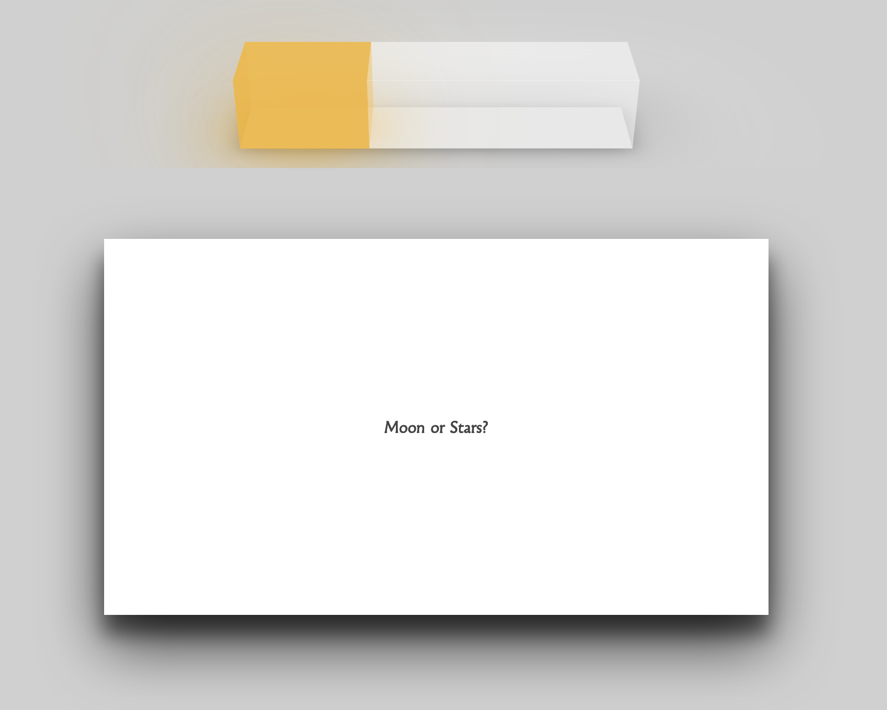
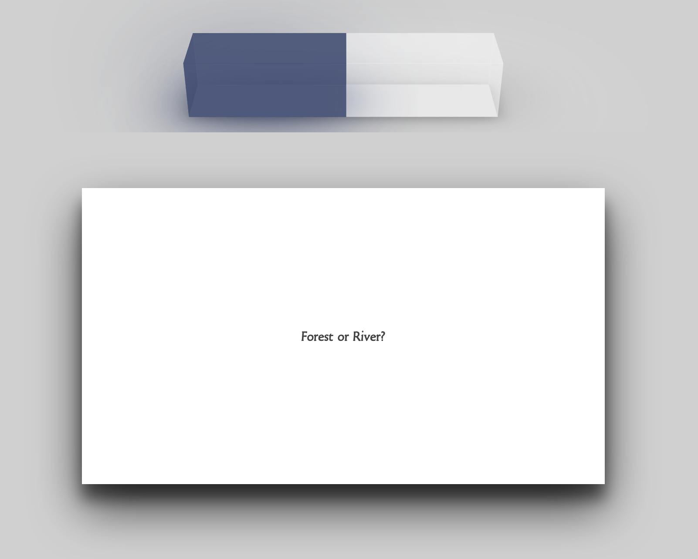
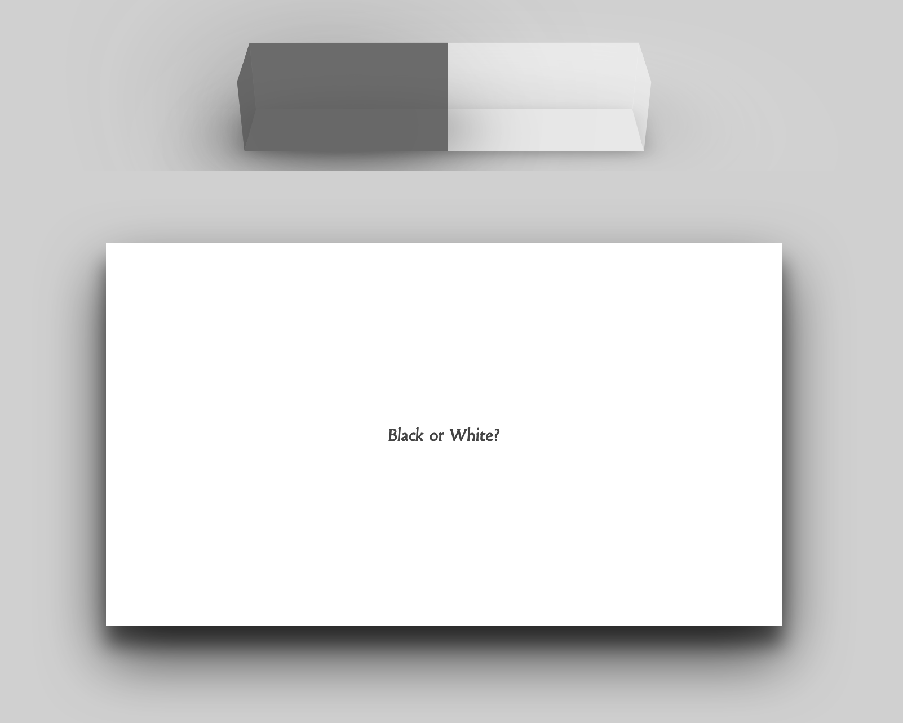

## React Sorting Hat

Below is the original summary for the assignment, I took it from there!

### React Sorting Hat - Stretch Assignment

Welcome to Hogwarts, the School of Whitchcraft and Wizardy. One of the tools that is used by students of Hogwarts on their first day entering the school is notoriously known as the `Sorting Hat`. Your goal throughout this stretch assignment is to build the `Sorting Hat` using ReactJS.

#### About this project

Obviously I'm using React, here with functional components, and Context API for state management/sharing. 
I use Hooks as well.
I'm especially proud of the progress bar component, found online as a static CSS styled "object" which I made dynamic!
It may not be obvious at first when using the app, that you need to mouse off of, or touch off of the cards to flip them back to the question side.

##### Todo
I would like to add a touch more color, and some social features.

This project is hosted on my private server [HERE CLICK ME!](https://magic.danielmattox.com)

##### Screenshots
The progress bar changes color as it fills to reflect the house that you are most alike up to that point based on your answers.

